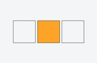

# jCore

JavaScript library for building UI components

## Features

- Support existing HTML without any special annotations
- Small, simple, and no transpiler
- Standalone, no dependencies

## Examples

#### Toggle switches

[Demo](https://jsfiddle.net/f19p6yao/)



#### Nested draggable boxes

[Demo](https://jsfiddle.net/cw6jak8m/)


## Usage

```
<script src="jcore.js"></script>
```

Works on IE9+, Firefox, Safari, Chrome, Opera

## API

### DOM updates

#### Component([element])

Get started with components by creating a custom component class.
You can pass the existing DOM element as an argument to a constructor of the component.

```js
class MyComponent extends jCore.Component {
  constructor(el) {
    super(el);
  }
}

const el = document.getElementById('content');
const c = new MyComponent(el);

console.log(el === c.el);  // output: true
```

#### Component#el

A reference to an element of the component.

#### Component#render()

This method is called to create an element of the component if no element is passed to a constructor of the component.

```js
class MyComponent extends jCore.Component {
  constructor() {
    super();
  }

  render() {
    const el = document.createElement('div');
    el.textContent = 'My component';
    return el;
  }
}

const c = new MyComponent();

console.log(c.el.textContent);  // output: "My component"
```

#### Component#prop(value)

Return a getter/setter function that stores arbitrary data.
You can use this method to make a property of the component.

```js
class Rect extends jCore.Component {
  constructor(el, x, y, width, height) {
    super(el);

    // create each property as a getter-setter with their initial values
    this.x = this.prop(x);
    this.y = this.prop(y);
    this.width = this.prop(width);
    this.height = this.prop(height);
  }
}

const el = document.getElementById('rect');
const rect = new Rect(el, 0, 0, 200, 100);

// get the value of x
const a = rect.x(); // a == 0

// set the value of x
rect.x(50);

const b = rect.x(); // b == 50
```

#### Component#onredraw()

This method is called at the next redraw cycle of the browser (achieved by window.requestAnimationFrame) to update a DOM element when you set a new value to a setter which is created from [*prop()*](#componentpropvalue).

```js
class Rect extends jCore.Component {
  constructor(el, x, y, width, height) {
    super(el);
    this.x = this.prop(x);
    this.y = this.prop(y);
    this.width = this.prop(width);
    this.height = this.prop(height);
  }

  onredraw() {
    // write code for updating the element
    this.el.style.left = this.x() + 'px';
    this.el.style.top = this.y() + 'px';
    this.el.style.width = this.width() + 'px';
    this.el.style.height = this.height() + 'px';
  }
}

const el = document.getElementById('rect');
const rect = new Rect(el, 0, 0, 200, 100);

for (let i = 0; i < 10000; i++) {
  rect.x(100);
  rect.y(200);
  rect.width(300);
  rect.height(400);
}

// rect.onredraw() will be called only once
```

#### Component#redrawBy(...propertyNames, callback)

This method is a helper function for updating a DOM element in [*onredraw()*](#componentonredraw).
The given callback will be called when the property which is specified by its name is updated.
Passed arguments of the callback are the latest values of each property.

```js
class Rect extends jCore.Component {
  constructor(el, x, y, width, height) {
    super(el);
    this.x = this.prop(x);
    this.y = this.prop(y);
    this.width = this.prop(width);
    this.height = this.prop(height);
  }

  onredraw() {
    this.redrawBy('x', x => {
      // called when 'x' is updated
      this.el.style.left = x + 'px';
    });

    this.redrawBy('y', y => {
      // called when 'y' is updated
      this.el.style.top = y + 'px';
    });

    this.redrawBy('width', width => {
      // called when 'width' is updated
      this.el.style.width = width + 'px';
    });

    this.redrawBy('height', height => {
      // called when 'height' is updated
      this.el.style.height = height + 'px';
    });
  }
}
```

You will be able to change an implementation of updating a DOM element without changing component's property names.

```js
class Rect extends jCore.Component {
  constructor(el, x, y, width, height) {
    super(el);
    this.x = this.prop(x);
    this.y = this.prop(y);
    this.width = this.prop(width);
    this.height = this.prop(height);
  }

  onredraw() {
    this.redrawBy('x', 'y', (x, y) => {
      // called when 'x' or 'y' is updated
      // use CSS property 'transform' to update a position of the component
      this.el.style.transform = 'translate(' + x + 'px, ' + y + 'px)';
    });

    this.redrawBy('width', width => {
      this.el.style.width = width + 'px';
    });
    this.redrawBy('height', height => {
      this.el.style.height = height + 'px';
    });
  }
}
```

#### Component#markDirty()

You can use this method to make a component ready for redrawing an element if there are some updates without setting a new value to a setter created from [*prop()*](#componentpropvalue).
After this method is called, [*redraw()*](#componentredraw) will be called at the next redraw cycle.

```js
class MultiLineText extends jCore.Component {
  constructor(el) {
    super(el);
    this.textList = [];
  }

  addText(text) {
    this.textList.push(text);

    // the content of 'textList' is updated and it needs to redraw
    this.markDirty();
  }

  onredraw() {
    this.el.innerHTML = this.textList.join('<br>');
  }
}
```

You will use this method for an initial update of the element.

```js
class Rect extends jCore.Component {
  constructor(el, x, y, width, height) {
    super(el);
    this.x = this.prop(x);
    this.y = this.prop(y);
    this.width = this.prop(width);
    this.height = this.prop(height);

    // for initial update (this.onredraw() will be called)
    this.markDirty();
  }

  onredraw() {
    this.redrawBy('x', 'y', (x, y) => {
      this.el.style.transform = 'translate(' + x + 'px, ' + y + 'px)';
    });
    this.redrawBy('width', width => {
      this.el.style.width = width + 'px';
    });
    this.redrawBy('height', height => {
      this.el.style.height = height + 'px';
    });
  }
}

const el = document.getElementById('rect');
const rect = new Rect(el, 0, 0, 200, 100);
```

#### Component#redraw()

This method calls [*onredraw()*](#componentonredraw), and if a parent element of the component's element is changed by calling [*parentElement()*](#componentparentelementelementnull), then it applies DOM insertion or removal of the element to the DOM tree.
You can use this method to update the element forcibly.
It is not recommended to override this method in custom components.

```js
class Rect extends jCore.Component {
  constructor(el, x, y, width, height) {
    super(el);
    this.x = this.prop(x);
    this.y = this.prop(y);
    this.width = this.prop(width);
    this.height = this.prop(height);
  }

  onredraw() {
    this.redrawBy('x', 'y', (x, y) => {
      this.el.style.transform = 'translate(' + x + 'px, ' + y + 'px)';
    });
    this.redrawBy('width', width => {
      this.el.style.width = width + 'px';
    });
    this.redrawBy('height', height => {
      this.el.style.height = height + 'px';
    });
  }
}

const el = document.getElementById('rect');
const rect = new Rect(el, 0, 0, 200, 100);

rect.redraw();
const a = window.getComputedStyle(rect.el).width;  // a == '200px'

// change the value of 'width'
rect.width(100);

const b = window.getComputedStyle(rect.el).width;  // b == '200px' (DOM element has not yet updated)

rect.redraw();
const c = window.getComputedStyle(rect.el).width;  // c == '100px'
```

### DOM insertion/removal

#### Component#parentElement(element|null)

Get or set a parent element of the component's element.
If you change a parent element, the component's element will be appended into the given parent element.
You cat set a parent element as null and the component's element will be removed from the DOM tree.
This DOM insertion and removal is the only indirect changes to a DOM element in jCore library.

```js
class MyComponent extends jCore.Component {
  constructor() {
    super();
  }

  render() {
    const el = document.createElement('div');
    el.textContent = 'My component';
    return el;
  }
}

const c = new MyComponent();
const parent = document.getElementById('parent');
c.parentElement(parent);
c.redraw();

console.log(c.el.parentNode === parent);  // output: true
```

#### Component#element(element)

Get or set the component's element.
If you set a new element, [*parentElement()*](#componentparentelementelementnull) is also called with the parent element of the element.
It is unusual to call this method.

#### Component#onappend()

This method is called when an element is appended into a parent element by calling [*parentElement()*](#componentparentelementelementnull).
You can override this method for a registration of event listeners or loading resources and so on.

#### Component#onremove()

This method is called when an element is removed by calling [*parentElement()*](#componentparentelementelementnull).
You can override this method for an unregistration of event listeners or releasing resources and so on.

```js
class ClickableComponent extends jCore.Component {
  constructor() {
    super();
    this.onclick = this.onclick.bind(this);
  }

  onappend() {
    this.el.addEventListener('click', this.onclick);
  }

  onremove() {
    this.el.removeEventListener('click', this.onclick);
  }

  onclick() {
    console.log('clicked');
  }
}
```

### Built-in event emitter

Components have similar methods of the [*EventEmitter*](https://nodejs.org/api/events.html#events_class_eventemitter) module found in Node.js as follows.

#### Component#on(type, listener)
#### Component#emit(type[, ...args])
#### Component#off(type, listener)
#### Component#removeAllListeners([type])

```js
class ClickableComponent extends jCore.Component {
  constructor() {
    super();
    this.onclick = this.onclick.bind(this);
    this.count = 0;
  }

  onappend() {
    this.el.addEventListener('click', this.onclick);
  }

  onremove() {
    this.el.removeEventListener('click', this.onclick);
  }

  onclick(event) {
    this.emit('click', ++this.count);
  }
}

const c = new ClickableComponent();

c.on('click', count => {
  console.log('clicked ' + count + ' times');
});
```

### Interaction with other components

#### Relation()

Sometimes changing state of a component is associated with a state of another component.
jCore takes a unique approach for related changes on a group of components.
Every component can have a relation object that is used for updating other components when just before redrawing itself.

#### Relation#update(component)

This method is called just before the component which has a relation object is redrawing.
You can override this method and implement for the changes of related components.

#### Component#addRelation(relation)

Add a relation object to a component.

#### Component#removeRelation(relation)

Remove a relation object from a component.

### Draggable components

#### Draggable(component)

jCore provides a built-in module for making a draggable component.
You can make a custom draggable class and pass a component as an argument to make it draggable.

#### Draggable#enable()

Activate the draggable module.
The module is not activated by default.

#### Draggable#disable()

Deactivate the draggable module.

#### Draggable#onstart(component, x, y, event, context)

A handler method to get event for drag start.

#### Draggable#onmove(component, dx, dy, event, context)

A handler method to get event for moving.

#### Draggable#onend(component, dx, dy, event, context)

A handler method to get event for drag end.

## Code example (Relation & Draggable)

- Create two rectangle components
- The rectangles are draggable
- Each rectangle moves together with keeping a certain distance between the rectangles

[Demo](https://jsfiddle.net/owdv8qyj/)

```js
class Rect extends jCore.Component {
  constructor(el, x, y, width, height) {
    super(el);
    this.x = this.prop(x);
    this.y = this.prop(y);
    this.width = this.prop(width);
    this.height = this.prop(height);
    this.draggable = new RectDraggable(this);

    this.draggable.enable();
    this.markDirty();
  }

  onredraw() {
    this.redrawBy('x', 'y', (x, y) => {
      this.el.style.transform = 'translate(' + x + 'px, ' + y + 'px)';
    });
    this.redrawBy('width', width => {
      this.el.style.width = width + 'px';
    });
    this.redrawBy('height', height => {
      this.el.style.height = height + 'px';
    });
  }
}

class RectRelation extends jCore.Relation {
  constructor(relatedRect, offsetX, offsetY) {
    super();
    this.relatedRect = relatedRect;
    this.offsetX = offsetX;
    this.offsetY = offsetY;
  }

  update(rect) {
    this.relatedRect.x(rect.x() + this.offsetX);
    this.relatedRect.y(rect.y() + this.offsetY);
  }
}

class RectDraggable extends jCore.Draggable {
  onstart(rect, x, y, event, context) {
    event.preventDefault();
    context.x = rect.x();
    context.y = rect.y();
  }

  onmove(rect, dx, dy, event, context) {
    rect.x(context.x + dx);
    rect.y(context.y + dy);
  }
}

const elements = document.querySelectorAll('.rect');
const first = new Rect(elements[0], 0, 0, 100, 50);
const second = new Rect(elements[1], 0, 0, 100, 50);

first.addRelation(new RectRelation(second, 100, 100));
second.addRelation(new RectRelation(first, -100, -100));
```

## License

&copy; 2016 iOnStage
Licensed under the MIT License.
