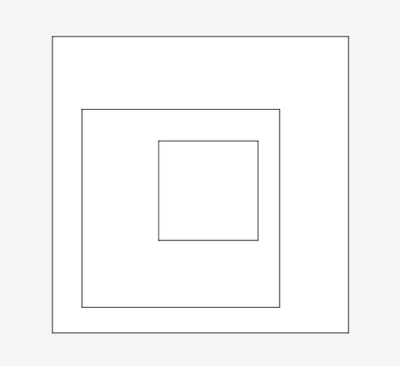

# jCore

JavaScript library for building UI components

## Features

- Small, simple, and just JavaScript
- Standalone, no dependencies
- Cross-browser: works on IE9+, Firefox, Safari, Chrome, Opera

## Example

#### Toggle switches

[Demo](https://jsfiddle.net/0y61L9jp/)

#### Nested draggable box

[Demo](https://jsfiddle.net/x4qfs912/)

## License

&copy; 2016 iOnStage
Licensed under the MIT License.
